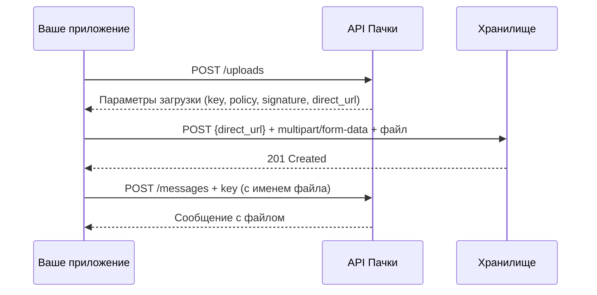

# Загрузка файлов

Загрузка файлов через API Пачки — трёхшаговый процесс с presigned URL (S3-совместимое хранилище).

## Обзор процесса




## Шаг 1: Получение параметров загрузки

Сделайте `POST`-запрос без тела для получения подписи и параметров:

**Получение параметров загрузки**

### cURL

```bash
curl -X POST "https://api.pachca.com/api/shared/v1/uploads" \
  -H "Authorization: Bearer YOUR_ACCESS_TOKEN"
```

### JavaScript

```javascript
const response = await fetch('https://api.pachca.com/api/shared/v1/uploads', {
  method: 'POST',
  headers: {
    'Authorization': 'Bearer YOUR_ACCESS_TOKEN',
  }
});

const data = await response.json();
console.log(data);
```

### Python

```python
import requests

headers = {
    'Authorization': 'Bearer YOUR_ACCESS_TOKEN',
}

response = requests.post(
    'https://api.pachca.com/api/shared/v1/uploads',
    headers=headers
)

print(response.json())
```

### Node.js

```javascript
const https = require('https');

const options = {
    hostname: 'api.pachca.com',
    port: 443,
    path: '/api/shared/v1/uploads',
    method: 'POST',
    headers: {
        'Authorization': 'Bearer YOUR_ACCESS_TOKEN'
    }
};

const req = https.request(options, (res) => {
    let data = '';

    res.on('data', (chunk) => {
        data += chunk;
    });

    res.on('end', () => {
        console.log(JSON.parse(data));
    });
});

req.on('error', (error) => {
    console.error(error);
});

req.end();
```

### Ruby

```ruby
require 'net/http'
require 'json'

uri = URI('https://api.pachca.com/api/shared/v1/uploads')
request = Net::HTTP::Post.new(uri)
request['Authorization'] = 'Bearer YOUR_ACCESS_TOKEN'

response = Net::HTTP.start(uri.hostname, uri.port, use_ssl: true) do |http|
  http.request(request)
end

puts JSON.parse(response.body)
```

### PHP

```php
<?php

$curl = curl_init();

curl_setopt_array($curl, [
    CURLOPT_URL => 'https://api.pachca.com/api/shared/v1/uploads',
    CURLOPT_RETURNTRANSFER => true,
    CURLOPT_CUSTOMREQUEST => 'POST',
    CURLOPT_HTTPHEADER => [
        'Authorization: Bearer YOUR_ACCESS_TOKEN',
    ],
]);

$response = curl_exec($curl);
curl_close($curl);

echo $response;
?>
```


В ответе вы получите параметры для следующего шага: `Content-Disposition`, `acl`, `policy`, `x-amz-credential`, `x-amz-algorithm`, `x-amz-date`, `x-amz-signature`, `key` и `direct_url`.

## Шаг 2: Загрузка файла

Отправьте `POST`-запрос с форматом `multipart/form-data` на адрес `direct_url`. Включите все полученные параметры и сам файл:

**cURL: загрузка файла**

```bash
curl -X POST "$DIRECT_URL" \\
  -F "Content-Disposition=$CONTENT_DISPOSITION" \\
  -F "acl=$ACL" \\
  -F "policy=$POLICY" \\
  -F "x-amz-credential=$X_AMZ_CREDENTIAL" \\
  -F "x-amz-algorithm=$X_AMZ_ALGORITHM" \\
  -F "x-amz-date=$X_AMZ_DATE" \\
  -F "x-amz-signature=$X_AMZ_SIGNATURE" \\
  -F "key=$KEY" \\
  -F "file=@./document.pdf"
```


При успешной загрузке сервер вернёт `HTTP 201 Created`.

> **Важно:** Порядок полей в multipart-запросе важен: файл (`file`) должен быть **последним** полем.


## Шаг 3: Использование файла

Подставьте имя загруженного файла в поле `key` (замените `${filename}` на реальное имя файла) и используйте его при отправке сообщения:

**Файл в сообщении**

```json
{
  "message": {
    "entity_type": "discussion",
    "entity_id": 12345,
    "content": "Документ прикреплён",
    "files": [
      {
        "key": "attaches/files/93746/e354fd79-.../document.pdf",
        "name": "document.pdf",
        "file_type": "file",
        "size": 102400
      }
    ]
  }
}
```


## Типы файлов

| Тип | `file_type` | Дополнительные поля |
|-----|-------------|---------------------|
| Файл | `file` | — |
| Изображение | `image` | `width`, `height` — размеры в пикселях |

## Полный пример

**Node.js: загрузка и отправка файла**

```javascript
const TOKEN = 'ваш_токен';
const BASE = 'https://api.pachca.com/api/shared/v1';
const headers = { Authorization: \`Bearer \${TOKEN}\` };

// Шаг 1: Получить параметры загрузки
const params = await fetch(\`\${BASE}/uploads\`, {
  method: 'POST', headers
}).then(r => r.json());

// Шаг 2: Загрузить файл
const form = new FormData();
form.append('Content-Disposition', params['Content-Disposition']);
form.append('acl', params.acl);
form.append('policy', params.policy);
form.append('x-amz-credential', params['x-amz-credential']);
form.append('x-amz-algorithm', params['x-amz-algorithm']);
form.append('x-amz-date', params['x-amz-date']);
form.append('x-amz-signature', params['x-amz-signature']);
form.append('key', params.key);
form.append('file', fs.createReadStream('./report.pdf'));

await fetch(params.direct_url, { method: 'POST', body: form });

// Шаг 3: Отправить сообщение с файлом
const fileKey = params.key.replace('\${filename}', 'report.pdf');
await fetch(\`\${BASE}/messages\`, {
  method: 'POST',
  headers: { ...headers, 'Content-Type': 'application/json' },
  body: JSON.stringify({
    message: {
      entity_type: 'discussion',
      entity_id: 12345,
      content: 'Отчёт прикреплён',
      files: [{ key: fileKey, name: 'report.pdf', file_type: 'file', size: 102400 }]
    }
  })
});
```


## Частые ошибки

| Ошибка | Причина | Решение |
|--------|---------|---------|
| `403 Forbidden` при загрузке | Истекла подпись | Параметры загрузки действительны ограниченное время. Запросите новые через `POST /uploads` |
| `400 Bad Request` | Неправильный Content-Type | Убедитесь, что запрос отправляется как `multipart/form-data`, а не `application/json` |
| Файл не отображается | Неверный `key` | Проверьте, что `${filename}` в ключе заменён на реальное имя файла |
