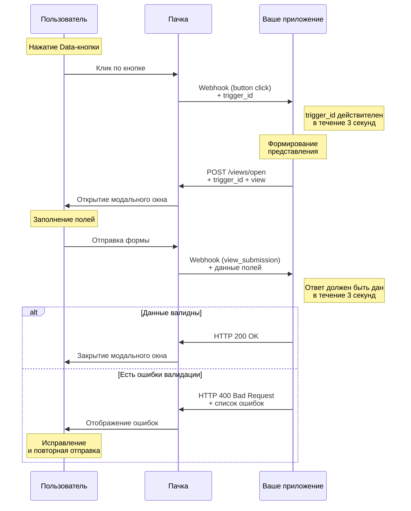

# Формы

Формы в Пачке позволяют вам отображать пользователям представления с указанным вами набором полей. Представления отображаются в виде модального окна, а результат заполнения формы вы можетет получить на свой сервер.

> На текущий момент вызов модального окна с представлением возможен только через кнопки в сообщении бота.


## Модальное окно

Модальное окно состоит из стандартных элементов - заголовка, кнопки закрытия (отмены), набора полей (подзаголовки, текст, ввод текста, выбор, списки и тд.) и кнопки отправки.


*Модальное окно*


## Жизненный цикл модального окна

Всё начинается с нажатия пользователем `Data-кнопки` кнопки в сообщении.

- В результате нажатия кнопки вашему приложению отправляется исходящий вебхук с уникальным `trigger_id`;
- Затем [приложение формирует представление и отправляет его](#открытие-представления), а пользователю отображается модальное окно;
- Далее пользователь [заполняет поля](#блоки-представления) и [вашему приложению отправляется исходящий вебхук](#получение-результатов) с данными заполненных пользователем полей в представлении;
- В ответе на вебхук ваше приложение может [отправить список ошибок](#отображение-ошибок), которые необходимо отобразить пользователю в представлении, или ответить кодом 200 (после чего модальное окно будет [закрыто](#закрытие-представления)).

**Жизненный цикл модального окна**




## Блоки представления

Блоки - это компоненты представления, которые позволяют вам формировать необходимые поля ввода данных и отображать дополнительную пояснительную информацию. Они указываются в поле `view.blocks` при открытии представления. Вы можете добавить до **100 блоков** в одно представление.

### Заголовок (header)


*Заголовок*


#### ViewBlockHeader

- `type` (string, **обязательный**): Тип блока
  - **Возможные значения:**
    - `header`: Для заголовков всегда header
- `text` (string, **обязательный**): Текст заголовка
  - Максимальная длина: 150 символов


### Обычный текст (plain_text)


*Обычный текст*


#### ViewBlockPlainText

- `type` (string, **обязательный**): Тип блока
  - **Возможные значения:**
    - `plain_text`: Для обычного текста всегда plain_text
- `text` (string, **обязательный**): Текст
  - Максимальная длина: 12000 символов


### Форматированный текст (markdown)


*Форматированный текст*


#### ViewBlockMarkdown

- `type` (string, **обязательный**): Тип блока
  - **Возможные значения:**
    - `markdown`: Для форматированного текста всегда markdown
- `text` (string, **обязательный**): Текст
  - Максимальная длина: 12000 символов


В поле `text` вам необходимо прислать форматированный текст в синтаксисе `markdown`. Поддерживаются конструкции, указанные в таблице ниже.

| Элемент | Синтаксис | Результат |
|---------|-----------|-----------|
| Жирный | `**это жирный текст**` или `__это жирный текст__` | **это жирный текст** |
| Курсив | `*это курсивный текст*` или `_это курсивный текст_` | *это курсивный текст* |
| Ссылки | `[текст ссылки](https://www.google.com)` | [текст ссылки](https://www.google.com) |
| Маркированный список | `- первый пункт`<br/>`- второй пункт` | • первый пункт<br/>• второй пункт |
| Нумерованный список | `1. первый пункт`<br/>`2. второй пункт` | 1. первый пункт<br/>2. второй пункт |
| Зачеркнутый | `~~это зачеркнутый текст~~` | ~~это зачеркнутый текст~~ |
| Строчный код | `` `код в тексте` `` | `код в тексте` |
| Блок кода | `` ``` ``<br/>Блок кода<br/>`` ``` `` | `Блок кода` |

### Разделитель (divider)


*Разделитель*


#### ViewBlockDivider

- `type` (string, **обязательный**): Тип блока
  - **Возможные значения:**
    - `divider`: Для разделителя всегда divider


### Текстовое поле (input)


*Текстовое поле*


#### ViewBlockInput

- `type` (string, **обязательный**): Тип блока
  - **Возможные значения:**
    - `input`: Для текстового поля всегда input
- `name` (string, **обязательный**): Название, которое будет передано в ваше приложение как ключ указанного пользователем значения
  - Максимальная длина: 255 символов
- `label` (string, **обязательный**): Подпись к полю
  - Максимальная длина: 150 символов
- `placeholder` (string, опциональный): Подсказка внутри поля ввода, пока оно пустое
  - Максимальная длина: 150 символов
- `multiline` (boolean, опциональный): Многострочное поле
- `initial_value` (string, опциональный): Начальное значение в поле
  - Максимальная длина: 3000 символов
- `min_length` (integer, int32, опциональный): Минимальная длина текста, который должен написать пользователь. Если пользователь напишет меньше, он получит ошибку.
  - Минимум: 0
  - Максимум: 3000
- `max_length` (integer, int32, опциональный): Максимальная длина текста, который должен написать пользователь. Если пользователь напишет больше, он получит ошибку.
  - Минимум: 1
  - Максимум: 3000
- `required` (boolean, опциональный): Обязательность
- `hint` (string, опциональный): Подсказка, которая отображается под полем серым цветом
  - Максимальная длина: 2000 символов


### Выпадающий список (select)


*Выпадающий список*


#### ViewBlockSelect

- `type` (string, **обязательный**): Тип блока
  - **Возможные значения:**
    - `select`: Для выпадающего списка всегда select
- `name` (string, **обязательный**): Название, которое будет передано в ваше приложение как ключ указанного пользователем выбора
  - Максимальная длина: 255 символов
- `label` (string, **обязательный**): Подпись к выпадающему списку
  - Максимальная длина: 150 символов
- `options` (array[object], опциональный): Массив доступных пунктов в выпадающем списке
  - Максимум элементов: 100
  - `text` (string, **обязательный**): Отображаемый текст
    - Максимальная длина: 75 символов
  - `value` (string, **обязательный**): Уникальное строковое значение, которое будет передано в ваше приложение при выборе этого пункта
    - Максимальная длина: 150 символов
  - `description` (string, опциональный): Пояснение, которое будет указано серым цветом в этом пункте под отображаемым текстом
    - Максимальная длина: 75 символов
  - `selected` (boolean, опциональный): Изначально выбранный пункт. Только один пункт может быть выбран.
- `required` (boolean, опциональный): Обязательность
- `hint` (string, опциональный): Подсказка, которая отображается под выпадающим списком серым цветом
  - Максимальная длина: 2000 символов


### Радиокнопки (radio)


*Радиокнопки*


#### ViewBlockRadio

- `type` (string, **обязательный**): Тип блока
  - **Возможные значения:**
    - `radio`: Для радиокнопок всегда radio
- `name` (string, **обязательный**): Название, которое будет передано в ваше приложение как ключ указанного пользователем выбора
  - Максимальная длина: 255 символов
- `label` (string, **обязательный**): Подпись к группе радиокнопок
  - Максимальная длина: 150 символов
- `options` (array[object], опциональный): Массив радиокнопок
  - Максимум элементов: 10
  - `text` (string, **обязательный**): Отображаемый текст
    - Максимальная длина: 75 символов
  - `value` (string, **обязательный**): Уникальное строковое значение, которое будет передано в ваше приложение при выборе этого пункта
    - Максимальная длина: 150 символов
  - `description` (string, опциональный): Пояснение, которое будет указано серым цветом в этом пункте под отображаемым текстом
    - Максимальная длина: 75 символов
  - `selected` (boolean, опциональный): Изначально выбранный пункт. Только один пункт может быть выбран.
- `required` (boolean, опциональный): Обязательность
- `hint` (string, опциональный): Подсказка, которая отображается под группой радиокнопок серым цветом
  - Максимальная длина: 2000 символов


### Чекбоксы (checkbox)


*Чекбоксы*


#### ViewBlockCheckbox

- `type` (string, **обязательный**): Тип блока
  - **Возможные значения:**
    - `checkbox`: Для чекбоксов всегда checkbox
- `name` (string, **обязательный**): Название, которое будет передано в ваше приложение как ключ указанного пользователем выбора
  - Максимальная длина: 255 символов
- `label` (string, **обязательный**): Подпись к группе чекбоксов
  - Максимальная длина: 150 символов
- `options` (array[object], опциональный): Массив чекбоксов
  - Максимум элементов: 10
  - `text` (string, **обязательный**): Отображаемый текст
    - Максимальная длина: 75 символов
  - `value` (string, **обязательный**): Уникальное строковое значение, которое будет передано в ваше приложение при выборе этого пункта
    - Максимальная длина: 150 символов
  - `description` (string, опциональный): Пояснение, которое будет указано серым цветом в этом пункте под отображаемым текстом
    - Максимальная длина: 75 символов
  - `checked` (boolean, опциональный): Изначально выбранный пункт
- `required` (boolean, опциональный): Обязательность
- `hint` (string, опциональный): Подсказка, которая отображается под группой чекбоксов серым цветом
  - Максимальная длина: 2000 символов


### Выбор даты (date)


*Выбор даты*


#### ViewBlockDate

- `type` (string, **обязательный**): Тип блока
  - **Возможные значения:**
    - `date`: Для выбора даты всегда date
- `name` (string, **обязательный**): Название, которое будет передано в ваше приложение как ключ указанного пользователем значения
  - Максимальная длина: 255 символов
- `label` (string, **обязательный**): Подпись к полю
  - Максимальная длина: 150 символов
- `initial_date` (string, date, опциональный): Начальное значение в поле в формате YYYY-MM-DD
- `required` (boolean, опциональный): Обязательность
- `hint` (string, опциональный): Подсказка, которая отображается под полем серым цветом
  - Максимальная длина: 2000 символов


### Выбор времени (time)


*Выбор времени*


#### ViewBlockTime

- `type` (string, **обязательный**): Тип блока
  - **Возможные значения:**
    - `time`: Для выбора времени всегда time
- `name` (string, **обязательный**): Название, которое будет передано в ваше приложение как ключ указанного пользователем значения
  - Максимальная длина: 255 символов
- `label` (string, **обязательный**): Подпись к полю
  - Максимальная длина: 150 символов
- `initial_time` (string, time, опциональный): Начальное значение в поле в формате HH:mm
- `required` (boolean, опциональный): Обязательность
- `hint` (string, опциональный): Подсказка, которая отображается под полем серым цветом
  - Максимальная длина: 2000 символов


### Загрузка файлов (file_input)


*Загрузка файлов*


#### ViewBlockFileInput

- `type` (string, **обязательный**): Тип блока
  - **Возможные значения:**
    - `file_input`: Для загрузки файлов всегда file_input
- `name` (string, **обязательный**): Название, которое будет передано в ваше приложение как ключ указанного пользователем значения
  - Максимальная длина: 255 символов
- `label` (string, **обязательный**): Подпись к полю
  - Максимальная длина: 150 символов
- `filetypes` (array[string], опциональный): Массив допустимых расширений файлов, указанные в виде строк (например, ["png","jpg","gif"]). Если это поле не указано, все расширения файлов будут приняты.
- `max_files` (integer, int32, опциональный): Максимальное количество файлов, которое может загрузить пользователь в это поле.
  - По умолчанию: `10`
  - Минимум: 1
  - Максимум: 10
- `required` (boolean, опциональный): Обязательность
- `hint` (string, опциональный): Подсказка, которая отображается под полем серым цветом
  - Максимальная длина: 2000 символов


## Открытие представления

Чтобы открыть модальное окно с представлением, ваше приложение должно иметь действительный, неистекший `trigger_id`. Это требование связано с тем, чтобы приложение открывало модальное окно только с разрешения пользователя и делало это быстро.

Для открытия представления используйте метод [Открытие представления](POST /views/open).

> **Важно:** С целью поддержания интерактивности и отзывчивости интерфейсов Пачки, срок жизни `trigger_id`
  ограничен и составляет **3 секунды**


## Получение результатов

После заполнения пользователей полей в представлении и отправки их, в ваше приложение отправляется исходящий вебхук. Вебхук будет отправлен на `Webhook URL`, который вы указали в настройках бота во вкладке «Исходящий Webhook», от имени которого было отправлено сообщение с кнопкой (нажатие на которую и вызвало открытие представления).

Задача вашего приложения - обработать входяший вебхук в короткое время и дать ответ. Это может быть как успех и команда на закрытие представления пользователю в интерфейсе Пачки, так и набор ошибок, которые необходио отобразить пользователю в представлении.

Ваше приложение должно дать ответ на вебхук в течение **3 секунд**. В ином случае, пользователь получит ошибку отправки в интерфейсе Пачки. Все значения полей будут сохранены и **пользователь повторит попытку отправки формы**. О том, как закрыть представление или отобразить ошибки по конкретным полям, вы можете прочитать в разделе [Закрытие и отображение ошибок](#закрытие-и-отображение-ошибок).

Вебхук содержит информацию, которая была заложена при открытии представления пользователю (такие поля, как `private_metadata` и `callback_id`), и данные заполненных полей представления.

Каждый исходящий вебхук защищён с помощью подписи, основанной на хешировании содержимого. Подробнее об этом, а также о других методах проверки подлинности исходящего вебхука, вы можете прочитать в блоке Безопасность.

#### Структура исходящего вебхука о заполнении формы

- `type` (string, опциональный): Тип объекта (для представлений всегда view)
  - **Возможные значения:**
    - `view`: представление
- `event` (string, опциональный): Тип события (для отправки пользователем формы всегда submit)
  - **Возможные значения:**
    - `submit`: отправка формы
- `private_metadata` (string, опциональный): Строка, заданная при отправке представления
- `callback_id` (string, опциональный): Идентификатор для распознавания этого представления, заданный при отправке представления
- `user_id` (integer, опциональный): Идентификатор пользователя, который заполнил форму
- `data` (object, опциональный): JSON карта заполненных полей представления, где каждый ключ - значение поля name.
  - `name` (string | array of strings | array of objects | null | [], опциональный): Значение, которое указал пользователь в поле (или массив значений, если это был множественный выбор или загруженные пользователем файлы). Если пользователь не указал значение, тогда null (или пустой массив, если это поле файлов или чекбоксов)
- `webhook_timestamp` (integer, опциональный): Дата и время отправки вебхука (UTC+0) в формате UNIX


**Пример вебхука о заполнении формы**

```json
{
    "type": "view",
    "event": "submit",
    "private_metadata": "{'timeoff_id':4378}",
    "callback_id": "timeoff_reguest_form",
    "user_id": 1235523,
    "data": {
        "date_start": "2025-07-01",
        "date_end": "2025-07-14",
        "request_doc": [
            {
                "name": "request.png",
                "size": 19153,
                "url": "<url>"
            }
        ],
        "accessibility": "phone_only",
        "info": "Поеду в сибирь на свадьбу лучшего друга",
        "newsletters": ["new_tasks", "project_updates"],
        "team": "success",
        "time": "22:00"
    },
    "webhook_timestamp": 1755075544
}
```


> **Внимание:** Срок жизни прямых ссылкок на скачивание файлов ограничен и составляет **1 час**


## Закрытие и отображение ошибок

После заполнения пользователем полей в представлении в приложение будет отправлен исходящий вебхук. В этот момент вы можете сохранить полученные значения или провести валидацию правильности заполнения полей и отправить пользователю ошибки.

Вам необходимо оперативно ответить на вебхук (кодом `200` или `400` со списком ошибок). В ином случае, пользователь получит ошибку отправки в интерфейсе Пачки. Все значения полей будут сохранены и **пользователь повторит попытку отправки формы**.

> **Важно:** С целью поддержания интерактивности и отзывчивости интерфейсов Пачки, время на ответ ограничего.
  Ваше приложение должно дать ответ на вебхук в течение **3 секунд**.


### Отображение ошибок

Если вы хотите отобразить пользователю ошибки заполнения конкретных полей представления, то ответ должен быть `HTTP 400 Bad Request`, а тело ответа содержать массив полей с указанием текста ошибки.

#### Тело ответа с указанием текста ошибки для каждого поля

- `errors` (object, опциональный): JSON карта ошибок для полей, где каждый ключ - name поля представления.
  - `name` (string, опциональный): Текст ошибки, который отобразится под полем красным цветом
    - Максимальная длина: 2000 символов


**Пример ответа на вебхук для отображения ошибок**

```http
HTTP/1.1 400 Bad Request
Server: nginx/1.14.2
Date: Wed, 22 Apr 2025 12:32:29 GMT
Content-Type: application/json; charset=utf-8
Transfer-Encoding: chunked
Connection: close
ETag: W/"4d63aae1430a3bbd35e95e3db6b364df"
Cache-Control: max-age=0, private, must-revalidate
X-Request-Id: 12f8a05c-c5cf-4a79-8d2f-f82cc477c410
X-Runtime: 0.117503
Vary: Origin
X-Rack-CORS: miss; no-origin

{
    "errors": {
        "date_end": "Дата окончания отпуска не может быть меньше даты начала",
        "request_doc": "В заявлении не найдена электронная подпись"
    }
}
```


*Пример отображения ошибок в интерфейсе представления*


### Закрытие представления

Если вы хотите просто закрыть пользователю представление (нет необходимости отображать ошибки), то ответ должен быть `HTTP 200 OK`. Никакое тело ответа не требуется.

**Пример ответа на вебхук для закрытия представления**

```http
HTTP/1.1 200 OK
Server: nginx/1.14.2
Date: Wed, 22 Apr 2025 12:32:29 GMT
Content-Type: text/plain; charset=utf-8
```

