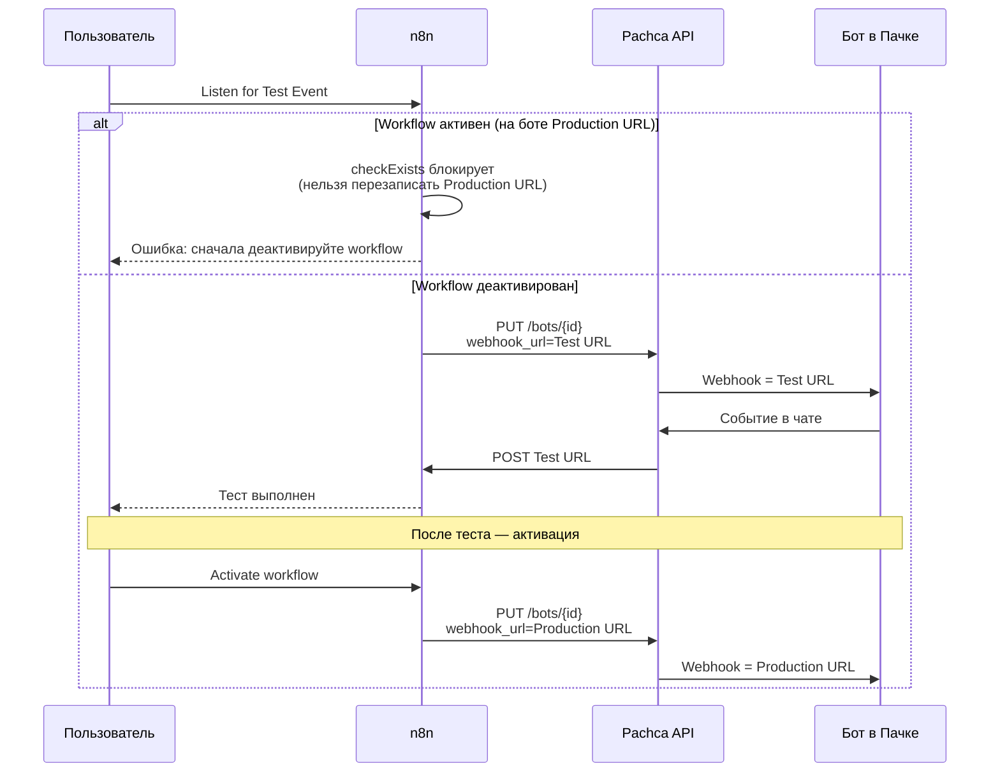

# Тестирование

В n8n тестирование узлов Пачки делится на две задачи:

- **Тестирование экшн-узлов** (узел **Pachca**) — отправка сообщений, создание задач, работа с чатами. Тестируется как любой другой узел n8n: через **Execute Step** и **Pin Data**.
- **Тестирование триггера** (узел **Pachca Trigger**) — требует отдельного внимания, потому что у бота в Пачке только **один слот** для webhook URL, и неправильный тест может сломать живой workflow.

На этой странице — обе задачи, плюс приёмы отладки и локальной разработки.

## Инструменты n8n для тестирования

| Инструмент | Что делает | Для чего применять |
|-----------|-----------|---------------------|
| **Execute Workflow** | Запуск всего workflow с первого узла | Полный прогон цепочки с Manual Trigger |
| **Execute Step** | Запуск одного узла с данными предыдущего | Отладка конкретного узла без перезапуска всего |
| **Pin Data** | Закрепление выходных данных узла | Мокирование входа для последующих узлов |
| **Listen for Test Event** | Временная регистрация Test URL на 120 секунд | Отладка триггера с реальным событием |
| **Active workflow** | Постоянная регистрация Production URL | Продакшен-запуск, ловит реальные события |

> Execute Step, Pin Data и Listen for Test Event — это стандартные возможности n8n, подробнее в [официальной документации n8n](https://docs.n8n.io/workflows/executions/). Ниже — как применять их к узлам Пачки.

## Тестирование экшн-узлов

Узел **Pachca** (действие) — это обычный n8n-узел, который вызывает REST API Пачки. Его можно тестировать без запуска всего workflow.

### Запуск одного узла через Execute Step

Откройте узел **Pachca**, настройте параметры (Resource, Operation, поля) и нажмите **Execute Step** в верхней части панели. n8n выполнит только этот узел, используя данные из предыдущего узла (если он уже отработал).

*После Execute Step узлы подсвечиваются зелёным*

При успехе:

- Узел подсвечивается зелёным и показывает количество обработанных элементов
- В панели **Output** появляется ответ API с данными операции

*Ответ API в Output*

> **Внимание:** Перед тестом отправки сообщения убедитесь, что бот [добавлен в целевой чат](/guides/bots#dostupy-bota-k-chatam-i-soobscheniyam) и у токена есть нужный [скоуп](/api/authorization#skoupy). Иначе вы получите 403 Forbidden — симптомы и решения в разделе [Устранение ошибок](/guides/n8n/troubleshooting#nedostatochno-prav-403-forbidden).

### Мокирование входных данных через Pin Data

Функция **Pin Data** позволяет закрепить выходные данные узла, чтобы последующие узлы при отладке использовали фиксированный вход вместо вызова API или ожидания события.

Типовой сценарий — отладка workflow с триггером без ожидания реального события:

  ### Шаг 1. Получите один пример события

Разово выполните **Listen for Test Event** на триггере и отправьте одно реальное событие (например, сообщение в чат бота). n8n запишет тело события в Output.

  ### Шаг 2. Закрепите выход триггера

Нажмите на иконку булавки (**Pin**) в правом верхнем углу панели Output узла **Pachca Trigger**. Теперь это тело зафиксировано — n8n будет подставлять его как вход для следующих узлов при отладке.

  ### Шаг 3. Отлаживайте цепочку

Меняйте настройки узлов IF, Switch, Pachca — при нажатии **Execute Step** они будут получать зафиксированный вход триггера. Не нужно ждать новых событий от Пачки.

  ### Шаг 4. Уберите Pin перед активацией

Перед **Activate** снимите Pin, иначе в продакшене узлы будут обрабатывать одно и то же зафиксированное событие.

> Pin Data особенно полезен при разработке бота-эхо или логики с IF-ветками: вы отлаживаете маршрутизацию и ответ без ручной отправки сообщений в Пачку.

### Проверка Credentials

Перед первым запуском нажмите **Test** в форме Credentials. n8n вызовет [Информация о токене](GET /oauth/token/info) и покажет результат:

*Connection tested successfully*

При ошибке 401 — токен неверный или просрочен. Симптомы и решения — в разделе [401 Unauthorized](/guides/n8n/troubleshooting#nevernyi-token-401-unauthorized).

## Тестирование триггера

Узел **Pachca Trigger** работает через исходящий вебхук Пачки, и здесь есть критичная особенность: **у бота в Пачке только один слот для webhook URL**. Любая перезапись этого слота ломает текущий workflow.

Поэтому тестирование триггера — это не просто «нажал Listen for Test Event», а осознанный выбор: какой бот задействовать и как не перезатереть продакшен.

### Test URL и Production URL

У триггерного узла n8n два webhook URL — оба показаны в верхней части панели узла:

*Test URL и Production URL в панели узла*

| URL | Путь | Когда активен | Использование |
|-----|------|---------------|---------------|
| **Test URL** | `/webhook-test/...` | 120 секунд после нажатия **Listen for Test Event** | Отладка — данные видны прямо в редакторе |
| **Production URL** | `/webhook/...` | Пока workflow в состоянии **Active** | Продакшен — данные видны только во вкладке **Executions** |

> Test URL удобен тем, что n8n сразу показывает тело входящего события в редакторе — это лучший способ изучить структуру webhook-payload от Пачки.

### Как работает Listen for Test Event

Когда вы нажимаете **Listen for Test Event** на узле **Pachca Trigger** в автоматическом режиме:

1. n8n вызывает [Обновление бота](PUT /bots/{id}) с `webhook_url = Test URL`
2. Пачка записывает Test URL в настройки бота (в слот `outgoing_url`)
3. В течение 120 секунд бот отправляет события не на Production URL, а на Test URL
4. n8n перехватывает событие и показывает его в редакторе
5. По истечении 120 секунд Test URL деактивируется, но **в настройках бота он остаётся** — пока workflow не будет активирован заново

Именно шаг 5 — источник проблем: если до теста у бота был прописан Production URL вашего же workflow, он будет перезаписан Test URL. После 120 секунд Пачка будет продолжать слать события на мёртвый Test URL, и живой workflow молча сломается.

### Защита от перезаписи webhook-слота

Чтобы эта ситуация не происходила по ошибке, в **автоматическом** режиме Pachca Trigger блокирует попытку запустить **Listen for Test Event**, если на боте уже зарегистрирован Production URL этого же workflow. Узел выдаёт ошибку:

> Cannot listen for test events while the workflow is active — Pachca bots support only one webhook URL per bot, and a test run would overwrite the production webhook.

Это значит, что автоматический режим защищён от самого частого сценария — «забыл, что workflow активен, нажал Listen for Test Event и уронил продакшен».

> **Внимание:** В **ручном** режиме (значение по умолчанию) узел не управляет слотом и не может его защитить — ответственность за то, какой URL прописан в настройках бота, полностью на вас. Listen for Test Event в ручном режиме всё равно откроет Test URL в n8n, но Пачка ничего об этом не узнает, пока вы сами не пропишете Test URL в настройках бота.

### Три способа тестировать правильно

  ### Шаг 1. Отдельный бот для тестов (рекомендуется)

Создайте в Пачке второго бота специально для разработки. Сделайте отдельные Credentials с его токеном и используйте в тестовом workflow. На продакшене остаётся основной бот, на тестах — тестовый. Они никогда не конфликтуют, и вы можете свободно нажимать **Listen for Test Event** сколько угодно раз.

    Этот способ подходит для регулярной отладки и для команды: каждый разработчик может завести свой тестовый бот.

  ### Шаг 2. Временная деактивация продакшен-workflow

Если второго бота нет, деактивируйте продакшн-workflow перед тестом: нажмите **Active** в правом верхнем углу (переключатель станет серым). Узел **Pachca Trigger** вызовет [Обновление бота](PUT /bots/{id}) с пустым `webhook_url` и освободит слот.

    После этого запустите **Listen for Test Event**, проведите тест, снова активируйте workflow. На время теста продакшен будет выключен — учитывайте это, если на workflow приходит критичный трафик.

  ### Шаг 3. Подмена URL в ручном режиме

Оставьте **Webhook Setup** = **Manual** (значение по умолчанию) — в [ручном режиме](/guides/n8n/trigger#ruchnoi-rezhim) узел не управляет `outgoing_url`, и вы сами решаете, какой URL прописан в настройках бота в Пачке. Можно временно вручную заменить Production URL на Test URL в настройках бота, провести тест, затем вернуть Production URL обратно.

    Этот способ даёт максимальный контроль, но требует аккуратности — легко забыть вернуть Production URL.

**Listen for Test Event в автоматическом режиме**

## Отладка

### Просмотр Execution Data

В активном workflow данные выполнения не показываются в редакторе — их нужно смотреть во вкладке **Executions**:

1. Откройте workflow и перейдите на вкладку **Executions**
2. Выберите нужное выполнение по времени и статусу (успех / ошибка)
3. n8n покажет цепочку узлов с данными входа и выхода каждого узла в формате JSON

Этот же режим работает и для неудачных выполнений — полезно, если workflow молча не срабатывает в продакшене. Там же видно тело webhook-события от Пачки и ответ API.

### Retry On Fail

Для узлов, которые вызывают API Пачки, имеет смысл включить автоматический повтор при временных ошибках. В настройках узла:

1. Откройте вкладку **Settings** узла **Pachca**
2. Включите **Retry On Fail**
3. Настройте **Max Tries** (по умолчанию 3) и **Wait Between Tries** (по умолчанию 1000 мс)

> Расширение Pachca уже само обрабатывает 429 и 5xx с экспоненциальной задержкой и jitter (до 5 попыток, учитывается `Retry-After`). Retry On Fail в n8n — дополнительный слой на случай сетевых сбоев или таймаутов.

### Error Trigger workflow

Чтобы получать алерты о сбоях в продакшене, сделайте отдельный workflow с узлом **Error Trigger** — он запускается при любой ошибке в основных workflow:

  ### Шаг 1. Создайте workflow с Error Trigger

Новый workflow → добавьте узел **Error Trigger**. Он автоматически подхватит ошибки всех workflow, где указан в поле **Settings → Error Workflow**.

  ### Шаг 2. Отправьте алерт в чат Пачки

Добавьте после Error Trigger узел **Pachca** с операцией **Message → Create**. В поле **Content** используйте выражение с деталями ошибки из Error Trigger — например, `{{ $json.execution.error.message }}`.

  ### Шаг 3. Подключите Error Workflow к основным workflow

В каждом боевом workflow откройте **Settings** и в поле **Error Workflow** выберите созданный workflow с Error Trigger. Теперь любая ошибка в этом workflow будет отправлять сообщение в Пачку.

## Локальная разработка

Если вы запускаете n8n на своей машине (`npx n8n` или Docker без публичного домена), Пачка не сможет доставить вебхуки на `localhost` — сервера Пачки находятся в публичной сети.

Решение — туннель с публичным HTTPS-URL:

| Инструмент | Как работает |
|-----------|--------------|
| **n8n built-in tunnel** | `n8n start --tunnel` — встроенный туннель n8n, выдаёт временный публичный URL |
| **ngrok** | Отдельный сервис, пробрасывает любой локальный порт, стабильный URL по подписке |
| **Cloudflare Tunnel** | Бесплатный туннель через Cloudflare, требует свой домен |

> **Внимание:** `n8n start --tunnel` предназначен только для разработки — в продакшене используйте нормальный домен с HTTPS.

После запуска туннеля n8n автоматически подставит публичный URL в Test URL и Production URL узла **Pachca Trigger** — никаких дополнительных настроек не нужно.

Подробнее о настройке туннеля — в [официальной документации n8n](https://docs.n8n.io/hosting/configuration/start-workflows-with-webhooks/#tunneling-for-development).

## Если что-то пошло не так

- **Вебхук не приходит** — проверьте, что бот в чате и workflow активен. Симптомы и решения: [Вебхук не приходит](/guides/n8n/troubleshooting#vebkhuk-ne-prikhodit)
- **403 при активации Pachca Trigger** — токену не хватает `bots:write`. Решение: [403 Forbidden при активации Pachca Trigger](/guides/n8n/troubleshooting#403-forbidden-pri-aktivatsii-pachca-trigger)
- **Signature Mismatch** — Signing Secret в Credentials не совпадает с секретом бота. Решение: [Ошибка подписи](/guides/n8n/troubleshooting#oshibka-podpisi-signature-mismatch)
- **401 Unauthorized** — неверный или просроченный токен. Решение: [401 Unauthorized](/guides/n8n/troubleshooting#nevernyi-token-401-unauthorized)

Полный список типовых ошибок — в разделе [Устранение ошибок](/guides/n8n/troubleshooting).
