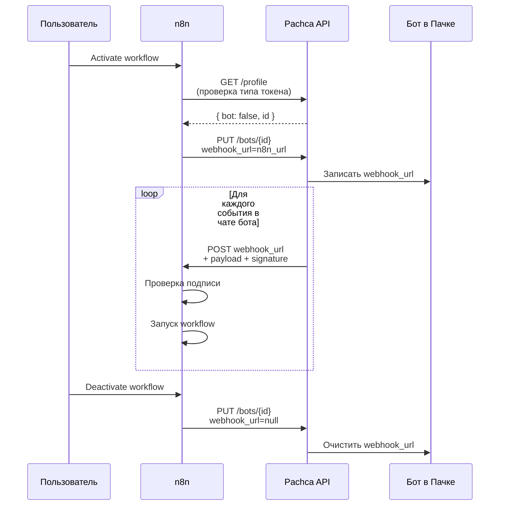

# Триггер

Узел **Pachca Trigger** запускает workflow при наступлении события в Пачке — новое сообщение, нажатие кнопки, отправка формы, изменение состава команды и др.

## Поддерживаемые события

### Сообщения и чаты

| Событие | Значение | Описание |
|---------|----------|----------|
| Новое сообщение | `new_message` | Создание сообщения в чате |
| Сообщение изменено | `message_updated` | Редактирование существующего сообщения |
| Сообщение удалено | `message_deleted` | Удаление сообщения |
| Новая реакция | `new_reaction` | Добавление реакции к сообщению |
| Реакция удалена | `reaction_deleted` | Удаление реакции с сообщения |
| Участник добавлен | `chat_member_added` | Добавление участника в чат |
| Участник удалён | `chat_member_removed` | Удаление участника из чата |

### Интерактивные элементы

| Событие | Значение | Описание |
|---------|----------|----------|
| Нажатие кнопки | `button_pressed` | Клик по Data-кнопке в сообщении |
| Отправка формы | `form_submitted` | Отправка модальной формы |
| Ссылка отправлена | `link_shared` | Бот может развернуть превью ссылки |

### Сотрудники

| Событие | Значение | Описание |
|---------|----------|----------|
| Приглашение сотрудника | `company_member_invite` | Отправлено приглашение новому сотруднику |
| Подтверждение регистрации | `company_member_confirm` | Сотрудник подтвердил регистрацию |
| Активация сотрудника | `company_member_activate` | Сотрудник активирован |
| Обновление сотрудника | `company_member_update` | Изменение данных сотрудника |
| Приостановка сотрудника | `company_member_suspend` | Сотрудник приостановлен |
| Удаление сотрудника | `company_member_delete` | Сотрудник удалён |

### Wildcard

| Событие | Значение | Описание |
|---------|----------|----------|
| Все события | `*` | Получать все типы событий |

*16 типов событий в Pachca Trigger*

> **Внимание:** Бот получает события только из чатов, в которых он состоит. Убедитесь, что бот добавлен в нужные чаты.

## Как работают вебхуки в Пачке

Бот в Пачке имеет **один слот** для исходящего webhook URL. Это значит:

- На одного бота можно зарегистрировать только **один URL**
- Новая запись полностью перезаписывает предыдущую
- Для тестов и продакшена рекомендуется использовать **разных ботов** — иначе тестовый запуск перезатрёт продовый URL

Pachca Trigger поддерживает два режима настройки: **автоматический** (узел сам регистрирует URL в Пачке при активации workflow) и **ручной** (вы копируете URL и вставляете его в настройки бота сами).

Добавьте узел **Pachca Trigger** в workflow — найдите его через поиск в панели узлов.

*Поиск Pachca Trigger*

## Как регистрируется вебхук

В узле **Pachca Trigger** параметр **Webhook Setup** определяет, кто прописывает Webhook URL в настройках бота — вы или сам узел:

| Режим | Что делает узел | Когда использовать |
|-------|-----------------|---------------------|
| **Ручной** (по умолчанию) | Не трогает настройки бота. Вы сами копируете Production URL из панели узла и вставляете его в настройки бота в Пачке. | Работает с любым токеном, включая токены ботов. Не может случайно перезатереть webhook-слот. |
| **Автоматический** | При активации workflow вызывает [Обновление бота](PUT /bots/{id}) и прописывает Production URL в настройках бота. При деактивации очищает. | Только **персональный токен** со скоупом `bots:write` и доступом редактора к выбранному боту. Для токенов ботов автоматический режим пока не поддерживается. |

> По умолчанию установлен **ручной режим** — он работает с любым типом токена и не может случайно перезаписать webhook-слот бота.

> **Внимание:** **Автоматический режим пока недоступен для токенов ботов.** Публичный API Пачки сейчас не разрешает боту обновлять собственный `outgoing_url` — это ограничение бекенда находится в активной разработке и будет снято в одном из ближайших обновлений. До этого момента используйте **ручной режим** (работает с любым токеном), **персональный токен** со скоупом `bots:write` и доступом редактора к боту (автоматический режим с указанием Bot ID в параметрах узла) или отдельный узел **Pachca → Bot → Update** (программная установка Webhook URL совместимо с v1).

## Ручной режим

*Настройка Pachca Trigger*

Режим по умолчанию. Узел не обращается к [Обновление бота](PUT /bots/{id}) — вы копируете Webhook URL из n8n и вставляете его в настройки бота в Пачке самостоятельно. При деактивации workflow узел тоже ничего не делает со слотом.

  ### Шаг 1. Добавьте Pachca Trigger

Создайте новый workflow, добавьте узел **Pachca Trigger** и выберите нужный тип события. Параметр **Webhook Setup** оставьте в значении **Manual** (это значение по умолчанию).

  ### Шаг 2. Скопируйте Production URL

В верхней части панели узла n8n показывает два URL:

    - **Test URL** (`/webhook-test/...`) — временный URL, активен только во время ручного теста через кнопку **Listen for test event**
    - **Production URL** (`/webhook/...`) — постоянный URL, работает, пока workflow активен

    Для настройки в Пачке нужен **Production URL**. Нажмите иконку копирования рядом с ним.

    

*Test URL и Production URL в верхней части панели узла*

  ### Шаг 3. Вставьте URL в настройки бота в Пачке

Откройте настройки вашего бота в Пачке, перейдите на вкладку **Исходящий Webhook** и вставьте скопированный Production URL в поле **Webhook URL**. Подробнее — в разделе [Исходящие вебхуки](/guides/webhook#nastroiki).

  ### Шаг 4. Вернитесь в n8n и активируйте

Нажмите **Activate** в n8n. С этого момента бот отправляет события в ваш workflow.

> **Внимание:** В ручном режиме URL в настройках бота вы ставите сами — значит и очищать его тоже нужно самостоятельно. Если вы удаляете workflow или меняете URL, очистите поле **Webhook URL** в настройках бота в Пачке вручную — иначе Пачка будет продолжать отправлять события на недоступный адрес.

## Автоматический режим

> Автоматический режим работает только с **персональным токеном**, у которого есть скоуп `bots:write` и доступ редактора к боту, которым вы хотите управлять. Для токенов ботов автоматическая регистрация пока не поддерживается (см. предупреждение выше).

*Автоматический режим с полем Bot ID и предупреждением о токенах ботов*

В автоматическом режиме узел сначала вызывает [Информация о профиле](GET /profile) — чтобы убедиться, что это не токен бота, — а затем вызывает [Обновление бота](PUT /bots/{id}) и прописывает Production URL в настройках бота. Bot ID узел не может определить сам: персональный токен не привязан к конкретному боту, поэтому ID нужно указать в параметре **Bot ID** самого узла.

  ### Шаг 1. Используйте персональный токен в Credentials

Откройте Pachca API Credentials и в поле **Access Token** вставьте персональный токен (из **Автоматизации** → **Интеграции** → **API**). Токен должен иметь скоуп `bots:write` и доступ редактора к целевому боту — это настраивается в Пачке в настройках самого бота.

  ### Шаг 2. Переключите Webhook Setup на Automatic

В узле **Pachca Trigger** выберите нужный тип события, затем установите **Webhook Setup** = **Automatic**.

  ### Шаг 3. Укажите Bot ID в узле

После переключения на **Automatic** в узле появится поле **Bot ID**. Вставьте туда ID бота, которому нужно прописать Webhook URL. Найти ID можно в адресе страницы настроек бота в Пачке.

  ### Шаг 4. Активируйте workflow

Нажмите **Activate** в правом верхнем углу. n8n вызовет [Информация о профиле](GET /profile) (проверка типа токена), затем [Обновление бота](PUT /bots/{id}) и зарегистрирует URL в настройках бота. С этого момента бот отправляет события в ваш workflow.

При деактивации workflow узел автоматически очищает URL в настройках бота — бот перестаёт отправлять события.

**Автоматическая регистрация вебхука**

> **Внимание:** **Если получили 403 Forbidden при активации** — у персонального токена либо нет скоупа `bots:write`, либо нет доступа редактора к указанному боту. Проверьте доступы в настройках бота в Пачке или вернитесь в **Manual**.

## Альтернатива: установка URL через узел Pachca Bot Update

Если вы хотите обновить `Webhook URL` программно прямо из workflow (например, в рамках деплой-пайплайна, или когда требуется переключать слот между разными n8n-серверами), используйте обычный узел **Pachca** с операцией **Bot → Update**. Этот путь работает в обеих версиях ноды, не требует активации trigger-workflow и ведёт себя одинаково с логикой v1.

1. Добавьте в workflow узел **Pachca**
2. Выберите **Resource** = **Bot**, **Operation** = **Update a bot**
3. Заполните **Bot ID** и **Webhook URL**
4. Запустите узел вручную или по расписанию

Тот же механизм даёт способ очистить слот: передайте в **Webhook URL** пустую строку.

## Тестирование

У бота в Пачке только **один слот** для webhook URL, поэтому тестовый запуск триггера требует осторожности — неправильный тест перезатирает продовый URL и ломает живой workflow. В автоматическом режиме Pachca Trigger блокирует **Listen for Test Event**, если workflow уже активен, — это защищает от самого частого сценария. В ручном режиме узел не управляет слотом, и ответственность за подмену URL полностью на вас. Полная инструкция с тремя способами тестирования и диаграммой — в отдельном разделе [Тестирование](/guides/n8n/testing#testirovanie-triggera).

## Безопасность

### Проверка подписи

Для защиты от поддельных запросов добавьте **Signing Secret** бота в [Credentials](/guides/n8n/setup#sozdanie-credentials). Trigger автоматически проверяет HMAC-SHA256 подпись каждого входящего запроса через заголовок `pachca-signature` и отклоняет невалидные.

Подробнее о механизме подписи — в разделе [Исходящие вебхуки](/guides/webhook#bezopasnost).

> Рекомендуется всегда использовать Signing Secret в продакшене для защиты от несанкционированных запросов.

### Ограничение по IP

Укажите **Webhook Allowed IPs** в [Credentials](/guides/n8n/setup#sozdanie-credentials) — через запятую список IP-адресов, с которых принимаются вебхуки. Пачка отправляет вебхуки с IP `37.200.70.177`.

Если поле пустое — проверка IP отключена и запросы принимаются с любого адреса.

> **Внимание:** Ограничение по IP — дополнительная мера. Заголовок `x-forwarded-for` может быть подменён, если n8n не стоит за доверенным reverse proxy. Используйте вместе с Signing Secret.

### Защита от повторов

Trigger автоматически отклоняет события старше **5 минут** (по полю `webhook_timestamp` в теле запроса). Это защищает от replay-атак — повторной отправки перехваченного запроса.

## Фильтрация событий

Выберите конкретный тип события для фильтрации — workflow будет запускаться только при совпадении. Можно выбрать только один тип события на один узел Trigger.

> Используйте **All Events** (`*`) и фильтруйте в последующих узлах (например, через IF или Switch), если нужна сложная логика маршрутизации по типу события или обработка нескольких типов в одном workflow.

Готовые сценарии с Pachca Trigger — в разделе [Примеры workflow](/guides/n8n/workflows).
