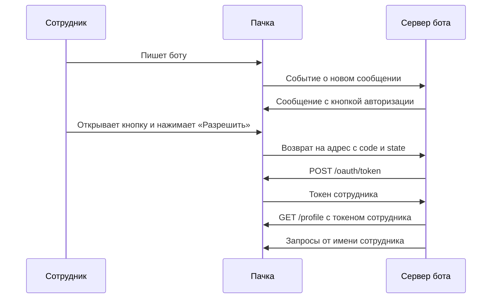

> Расположение: Авторизация от имени сотрудника
> Краткое содержание: Как бот получает токен сотрудника по шагам: ссылка авторизации с state и PKCE, кнопка в сообщении бота, возврат с кодом, обмен кода на токен, проверка сотрудника и обработка отказов. Пример на curl и TypeScript
> Это Markdown-версия конкретной страницы. Для контекста за её пределами (правила API, полный перечень методов, авторизация) ОБЯЗАТЕЛЬНО открой [llms.txt](https://dev.pachca.com/llms.txt) перед ответом — это сэкономит токены и предотвратит неполный ответ.


# Получение токена сотрудника

Бот получает токен сотрудника по стандартной схеме OAuth 2.0 с кодом авторизации ([RFC 6749](https://datatracker.ietf.org/doc/html/rfc6749#section-4.1)) и PKCE ([RFC 7636](https://datatracker.ietf.org/doc/html/rfc7636)). Перед началом включите авторизацию на вкладке **OAuth** в карточке бота — подробнее в разделе [Настройка бота](/guides/oauth/setup).

**Путь авторизации**




| Адрес | Назначение |
| --- | --- |
| `https://app.pachca.com/apps/authorize` | Экран согласия, на него ведёт кнопка |
| `https://api.pachca.com/api/shared/v1/oauth/token` | Обмен кода на токен |
| `https://api.pachca.com/api/shared/v1/oauth/revoke` | Отзыв токена |

Те же адреса публикуются в метаданных сервера авторизации по [RFC 8414](https://datatracker.ietf.org/doc/html/rfc8414): `https://api.pachca.com/.well-known/oauth-authorization-server`.

## Шаги


  ### Шаг 1. Сгенерируйте state и пару PKCE

На каждую кнопку создайте случайный `state` и проверочный код `code_verifier` — случайную строку длиной от 43 до 128 символов. Из него получите `code_challenge`: SHA-256 от `code_verifier` в кодировке base64url без `=` на конце.

Сохраните `state`, `code_verifier` и идентификатор сотрудника, которому отправляете кнопку: по `state` вы узнаете, чей это возврат. Для варианта **Браузер, мобильное, CLI** PKCE обязателен, для варианта **Серверное, с секретом** — рекомендуется.


  ### Шаг 2. Соберите ссылку авторизации

```text title="Ссылка авторизации"
https://app.pachca.com/apps/authorize
  ?client_id=CLIENT_ID
  &redirect_uri=https%3A%2F%2Fbot.example.com%2Foauth%2Fcallback
  &response_type=code
  &state=STATE
  &code_challenge=CODE_CHALLENGE
  &code_challenge_method=S256
```

- `client_id` — с вкладки **OAuth** в карточке бота
- `redirect_uri` — один из адресов возврата бота, совпадение проверяется точно
- `response_type` — всегда `code`
- `state` — значение из первого шага
- `code_challenge` и `code_challenge_method` — PKCE, метод только `S256`

Параметр `scope` передавать не нужно: набор прав сервер берёт из настроек бота.


  ### Шаг 3. Отправьте кнопку

Отправьте ссылку сотруднику URL-кнопкой в личной переписке с ботом — методом [Новое сообщение](/api/messages/create) с `entity_type: "user"`. Подробнее о кнопках — в разделе [Кнопки в сообщениях](/guides/buttons).


*Кнопка авторизации в сообщении бота*


В тексте рядом с кнопкой объясните, зачем боту доступ и что он будет делать, и попросите не пересылать ссылку.


  ### Шаг 4. Примите возврат

Сотрудник видит экран согласия и нажимает **Разрешить**. Браузер возвращается на ваш адрес с параметрами `code`, `state` и `iss` — последний всегда равен `https://api.pachca.com` и подтверждает, что код выдала Пачка.

```text title="Возврат после согласия"
https://bot.example.com/oauth/callback?code=AUTH_CODE&state=STATE&iss=https%3A%2F%2Fapi.pachca.com
```

Найдите сохранённый `state` и сразу удалите его: каждый `state` действует один раз. Если сотрудник нажал **Отменить**, возврата на ваш адрес не будет — браузер просто вернётся назад. Поэтому храните неиспользованные `state` ограниченное время, например сутки.


  ### Шаг 5. Обменяйте код на токен

Код живёт 10 минут и обменивается один раз. Серверное приложение передаёт `client_secret` в теле запроса или в заголовке `Authorization: Basic`, приложение без секрета — только `code_verifier`.

```bash title="Обмен кода на токен"
curl -X POST https://api.pachca.com/api/shared/v1/oauth/token \
  -d grant_type=authorization_code \
  -d code=AUTH_CODE \
  -d redirect_uri=https://bot.example.com/oauth/callback \
  -d client_id=CLIENT_ID \
  -d client_secret=CLIENT_SECRET \
  -d code_verifier=CODE_VERIFIER
```

```json title="Ответ"
{
  "access_token": "ACCESS_TOKEN",
  "token_type": "Bearer",
  "refresh_token": "REFRESH_TOKEN",
  "scope": "chats:read messages:read tasks:read tasks:create",
  "created_at": 1790242260
}
```

Поля `expires_in` в ответе нет: токен бессрочный и работает, пока сотрудник не отзовёт доступ. Обновлять его не нужно.


  ### Шаг 6. Проверьте, чей это токен

Запросите [Свой профиль](/api/profile/get) с новым токеном и сравните `data.id` с сотрудником, которому вы отправляли кнопку. Сообщение с кнопкой могли переслать, и тогда согласие дал другой сотрудник: такой токен отзовите и попросите сотрудника открыть кнопку из своей переписки.


  ### Шаг 7. Храните токен на сотрудника

Сохраните токен в привязке к сотруднику и передавайте в заголовке `Authorization: Bearer` при запросах от его имени. Токен даёт доступ ко всему, что видит сотрудник, в пределах выданных прав: храните его как пароль.


## Пример на TypeScript

Серверное приложение на Express: кнопка в ответ на сообщение сотрудника и обработчик возврата.

```typescript title="oauth.ts"
import crypto from "node:crypto"
import express from "express"

const API = "https://api.pachca.com/api/shared/v1"
const CLIENT_ID = process.env.PACHCA_CLIENT_ID!
const CLIENT_SECRET = process.env.PACHCA_CLIENT_SECRET!
const BOT_TOKEN = process.env.PACHCA_BOT_TOKEN!
const REDIRECT_URI = "https://bot.example.com/oauth/callback"

// state → кому отправлена кнопка и проверочный код PKCE
const pending = new Map<string, { userId: number; verifier: string }>()

export async function sendAuthButton(userId: number) {
  const state = crypto.randomBytes(16).toString("hex")
  const verifier = crypto.randomBytes(32).toString("base64url")
  const challenge = crypto.createHash("sha256").update(verifier).digest("base64url")
  pending.set(state, { userId, verifier })

  const url = new URL("https://app.pachca.com/apps/authorize")
  url.search = new URLSearchParams({
    client_id: CLIENT_ID,
    redirect_uri: REDIRECT_URI,
    response_type: "code",
    state,
    code_challenge: challenge,
    code_challenge_method: "S256",
  }).toString()

  await fetch(`${API}/messages`, {
    method: "POST",
    headers: { Authorization: `Bearer ${BOT_TOKEN}`, "Content-Type": "application/json" },
    body: JSON.stringify({
      message: {
        entity_type: "user",
        entity_id: userId,
        content: "Чтобы я мог работать с вашими задачами, разрешите доступ.",
        buttons: [[{ text: "Разрешить доступ", url: url.toString() }]],
      },
    }),
  })
}

const app = express()

app.get("/oauth/callback", async (req, res) => {
  const { code, state, error } = req.query as Record<string, string | undefined>
  const entry = state ? pending.get(state) : undefined
  if (!state || !entry) return res.status(400).send("Ссылка устарела, запросите новую у бота")
  pending.delete(state)
  if (error || !code) return res.status(400).send("Доступ не выдан, запросите новую ссылку у бота")

  const tokenResponse = await fetch(`${API}/oauth/token`, {
    method: "POST",
    headers: { "Content-Type": "application/x-www-form-urlencoded" },
    body: new URLSearchParams({
      grant_type: "authorization_code",
      code,
      redirect_uri: REDIRECT_URI,
      client_id: CLIENT_ID,
      client_secret: CLIENT_SECRET,
      code_verifier: entry.verifier,
    }),
  })
  if (!tokenResponse.ok) return res.status(502).send("Не удалось получить токен")
  const { access_token } = await tokenResponse.json()

  const profileResponse = await fetch(`${API}/profile`, {
    headers: { Authorization: `Bearer ${access_token}` },
  })
  const { data } = await profileResponse.json()
  if (data.id !== entry.userId) {
    // Кнопку открыл другой сотрудник: токен отзываем
    await fetch(`${API}/oauth/revoke`, {
      method: "POST",
      headers: { "Content-Type": "application/x-www-form-urlencoded" },
      body: new URLSearchParams({ token: access_token, client_id: CLIENT_ID, client_secret: CLIENT_SECRET }),
    })
    return res.status(403).send("Откройте кнопку из своей переписки с ботом")
  }

  await saveToken(entry.userId, access_token) // ваше хранилище токенов
  res.send("Готово, можно вернуться в Пачку")
})
```

## Ошибки и отказы

**При обмене кода**

- `invalid_grant` — код истёк, уже использован или выдан для другого `redirect_uri`, либо `code_verifier` не подходит к `code_challenge`. Отправьте сотруднику новую кнопку.
- `invalid_client` — неверный `client_id` или `client_secret`. Проверьте секрет: после обновления старое значение перестаёт работать сразу.

**При работе с токеном сотрудника**

- `401 Unauthorized` — сотрудник отозвал доступ, у бота отключили авторизацию или бот удалён. Удалите токен и, когда сотрудник снова обратится к боту, пришлите кнопку заново.
- `403 Forbidden` с `insufficient_scope` — права нет в выданном наборе или его не позволяет роль сотрудника. Повторная авторизация не поможет, если набор в настройках бота уже содержит это право: дело в роли. Подробнее о формате отказа — в разделе [Ошибки авторизации](/api/authorization#oshibki-avtorizatsii).

## Отзыв токена ботом

Бот может сам отозвать токен сотрудника, например когда тот отключает интеграцию в вашем сервисе. Серверное приложение отправляет на адрес отзыва `token` вместе с `client_id` и `client_secret`, приложение без секрета — сам токен в теле запроса и в заголовке `Authorization: Bearer`. Как сотрудник отзывает доступ сам — в разделе [Согласие и отзыв](/guides/oauth/consent).


## Связанные разделы

- [Настройка бота](/guides/oauth/setup)
- [Согласие и отзыв](/guides/oauth/consent)
- [Кнопки в сообщениях](/guides/buttons)
- [Авторизация](/api/authorization)
